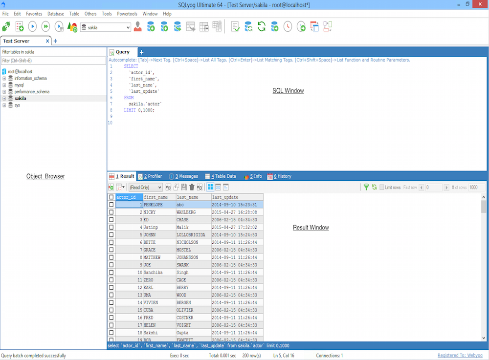
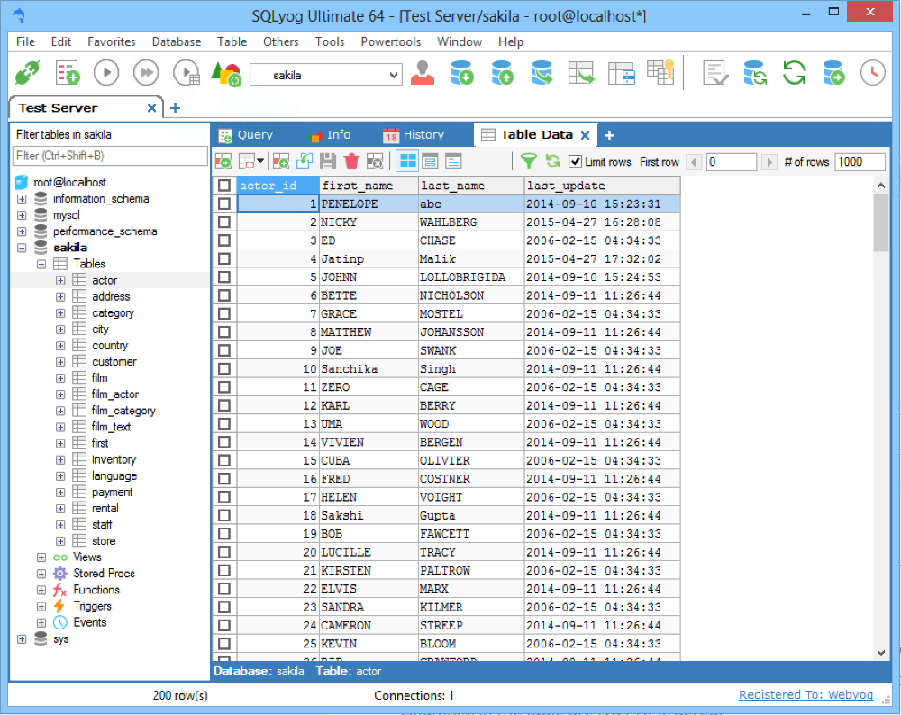

# SQLyog Community

SQLyog Community is the free GPL client for MySQL and MariaDB. SQLyog Ultimate is the paid seat on the same product line: schema sync, data sync, and the job agent. Both are a sqlyog mysql gui. mysql sqlyog is the same search when the engine name comes first.

This page is the handbook for that Windows GUI. It may also run on Linux and Unix through Wine. There is no .NET, no Java, no ODBC, no JDBC. You talk to the server over a native client, HTTP, or SSH.

Windows Vista and newer are the documented desktop. A 64-bit build is what people look for as sqlyog 64 bit. 32-bit installers exist on old pages. Prefer 64-bit.

Wine on Ubuntu is the documented Linux path. There is no official sqlyog for linux binary from Webyog. macOS is Wine as well. Native Mac is a frequent search, not a native build.

Two neighbor trees in this pack are the same class. HeidiSQL is a light desktop client for MariaDB, MySQL, SQL Server, PostgreSQL, SQLite, Interbase, and Firebird. MySQL Workbench is Oracle's MySQL GUI: SQL editor, modeler, admin, and migration. Use them when you want a second MySQL desktop next to sqlyog community edition.

| Engine | SQLyog | HeidiSQL | Workbench |
| --- | --- | --- | --- |
| MySQL | Yes | Yes | Yes (5.6+) |
| MariaDB | Yes | Yes | Via MySQL protocol |
| PostgreSQL | No | Yes | Migration source |
| SQL Server | No | Yes | Migration source |
| SQLite | No | Yes | Migration source |
| Interbase / Firebird | No | Yes | No |
| Access / Sybase / SQL Anywhere | No | No | Migration source |

HeidiSQL is written in Delphi and Lazarus/FreePascal. SQLyog Community is C++. Workbench is C++ with Python plugins. None of them need JDBC.

## Overview

SQLyog Community manages servers in physical, virtual, and cloud rooms: Amazon RDS and Aurora, Google Cloud SQL, Azure Database for MySQL. You create and alter tables, triggers, events, views, and procedures. You run SQL with completion and a visual join builder. You profile a query. You export and import.

SQLyog Ultimate adds visual schema comparison, data comparison, scheduled backup, and the SQLyog Job Agent. Community stays free. Ultimate is a commercial license.

Workbench, the Oracle neighbor, is a graphical tool for MySQL servers and databases. The snapshot on GitHub is published when a release ships. The team at Oracle maintains it. Docs live on the Workbench manual host. Downloads live on the MySQL downloads host. Third-party materials in that tree keep notices in License.txt.

Workbench, the Oracle neighbor, groups the same job into five topics.

**SQL Development.** Create and manage connections. Set parameters. Run SQL in a built-in editor.

Workbench stores connection parameters and opens the SQL Editor on that session. SQLyog Community does the same in an MDI tab. HeidiSQL does the same in its session window.

The SQLyog editor in this pack is [EditorQuery.cpp](FILES/EditorQuery.cpp). Heidi's connection form is [connections.pas](FILES/connections.pas). Workbench's wizard is [new_connection_wizard.cpp](FILES/connection/new_connection_wizard.cpp).

Completion, history, and a result grid sit next to the editor. Community query analyzer is a profiler, not a full Workbench EXPLAIN visual. Ultimate keeps that profiler and adds scheduled runs.

**Data Modeling (Design).** Draw a schema, reverse and forward engineer, edit tables, columns, indexes, triggers, partitions, privileges, routines, and views.

The Workbench Table Editor covers Tables, Columns, Indexes, Triggers, Partitioning, Options, Inserts, Privileges, Routines, and Views. SQLyog Community edits those objects in dialogs, not on a canvas. HeidiSQL edits them in Delphi forms.

SQLyog table create is [TableMakerCreateTable.cpp](FILES/table/TableMakerCreateTable.cpp). Heidi table editor is table_editor.pas in the same folder.

Reverse engineer in Workbench reads a live schema into a model. Forward engineer writes the model back. SQLyog Ultimate schema sync is the paid cousin of that pair. Community does not ship that sync.

**Server Administration.** Users, backup and recovery, audit, health, performance.

Workbench inspects audit data, database health, and server performance. SQLyog Community manages users and runs backups you start by hand. SQLyog Ultimate schedules backup and SJA jobs.

SQLyog users are [UserManager.cpp](FILES/UserManager.cpp). Workbench admin control is [wb_admin_control.py](FILES/admin/wb_admin_control.py). Heidi users are usermanager.pas in admin.

Health dashboards are a Workbench extra. Community users watch processlist and status in the GUI instead.

**Data Migration.** Workbench moves tables from SQL Server, Access, Sybase, SQLite, SQL Anywhere, PostgreSQL, and older MySQL into current MySQL.

Migration also supports moving from earlier MySQL to the latest releases. That is Oracle's path. SQLyog stays on MySQL and MariaDB and copies between those hosts.

The migrator here is [DataMigrator.py](FILES/migration/DataMigrator.py). SQLyog copy and export live in ExportAsSQL.cpp. Heidi sync is [syncdb.pas](FILES/sync/syncdb.pas).

db_copy_main.py and migration.py sit next to the migrator. Use them when you read how Workbench copies a schema. Do not paste those scripts into SQLyog Community.

**MySQL Enterprise Support.** Workbench talks to Enterprise Backup, Firewall, and Audit.

SQLyog Community does not. Those are Oracle extras. A Community user on stock MySQL or MariaDB does not need them. An Enterprise shop may keep Workbench beside mysql sqlyog.

| Edition | What you get |
| --- | --- |
| SQLyog Community | Free GPL GUI, query, objects, export, Wine |
| SQLyog Ultimate | Paid sync, compare, SJA, scheduled backup |
| HeidiSQL | Free multi-engine desktop |
| MySQL Workbench 8 | EOL snapshot of the Oracle GUI |

Community connection code is [ConnectionCommunity.cpp](FILES/connection/ConnectionCommunity.cpp). SSH and HTTP tunnels are [TunnelCommunity.cpp](FILES/connection/TunnelCommunity.cpp).

Object tree is [ObjectBrowser.cpp](FILES/browser/ObjectBrowser.cpp). Result grid is [ResultView.cpp](FILES/browser/ResultView.cpp). Query analyzer is [QueryAnalyzerCommunity.cpp](FILES/query/QueryAnalyzerCommunity.cpp). SQL dump is [ExportAsSQL.cpp](FILES/export/ExportAsSQL.cpp).

The Windows entry is [WinMain.cpp](FILES/WinMain.cpp). Heidi's session object is [dbconnection.pas](FILES/heidi/dbconnection.pas).

Workbench still documents MySQL 5.6 and higher. SQLyog Community follows the server you point it at. caching_sha2_password needs a current connector; old Community builds fail that plugin. Use a current sqlyog 64 bit build if that error appears.

HeidiSQL lets you browse and edit data, create and edit tables, views, procedures, triggers, and events. You can export structure and data to SQL, the clipboard, or another server. That is the same loop as mysql sqlyog: connect, inspect, change, dump.

| HeidiSQL surface | SQLyog Community analog |
| --- | --- |
| Browse and edit rows | Result grid |
| Tables, views, routines | Object browser and table maker |
| Export to SQL or another host | ExportAsSQL and copy |
| Multi-engine (PG, SQLite, MSSQL) | MySQL and MariaDB only |
| Forum and issue tracker | Webyog forum and FAQ |

Need help on HeidiSQL: online help page, forum for questions, issue tracker for bugs and features. That is the neighbor equivalent of the SQLyog forum.

HTTP tunnel code sits next to SSH in Http.cpp. Connection tabs are ConnectionTab.cpp. SQL formatter and maker live under editor. Import is ImportFromSQL.cpp. Preferences for Community are PreferenceCommunity.cpp.

SQLyog has no runtime layer. Workbench uses GRT, Python admin plugins, and a desktop file (mysql-workbench.desktop.in). HeidiSQL is Delphi on Windows. A Lazarus branch exists for other platforms; older Delphi than 12.1 will most likely fail.

Webyog also sells SQL DM for MySQL, a monitor, not this GUI. Release notes live on the SQLyog blog. A 14-day trial exists for commercial seats. Community does not need that trial.

Cloud hosts (RDS, Cloud SQL, Azure) take a direct TCP session or a tunnel. Fill host, port, user, and ACL password. Do not write a loopback URL into a shared note.

Agentless means you do not install an agent on the server. SJA on SQLyog Ultimate runs on a Windows box you control and talks to MySQL over the same channels Community already uses.

Visual query builder, query profiler, schema comparison, and data synchronization are the power tools people upgrade for. Community still types SQL. Ultimate draws the join and diffs two schemas.

Professional is another paid SKU on the vendor matrix. This handbook treats Community versus Ultimate. Price and trial length belong on the store, not here.

mysql vs sqlyog is a category error: one is the engine, one is the GUI. HeidiSQL and Workbench sit in the GUI column with SQLyog Community.

## Need help

SQLyog Community support is the Webyog forum and the SQLyog FAQ. SQLyog Ultimate buyers use vendor support.

HeidiSQL help is the online help page. Questions go to the forum. Bugs and feature requests go to the issue tracker.

Workbench issues go to the MySQL bug system. A GitHub pull request is also accepted. The published tree is a snapshot of an internal repo at each release. Workbench 8 in this pack is the EOL line.

Do not paste a machine-local URL into a ticket. Give the server version, the SQLyog build, and whether you used SSH or HTTP.

Look at HeidiSQL screenshots and the feature list on the Heidi site if you need a visual of tabs and the grid. SQLyog Community looks like a classic MDI Windows app: object tree on the left, editor and grid on the right.

## Translation

HeidiSQL translations live on Transifex. Register, join a language, or request a new one.

SQLyog Community ships localization files in its own tree. Workbench uses gettext style `po` files. Do not mix the three catalogs.

A new HeidiSQL language starts as a request on Transifex, not as a pull request of raw strings in source. SQLyog L10n files stay next to the Community sources. Workbench translators follow the MySQL po workflow.

## Contributing to HeidiSQL

Pull requests on HeidiSQL are for bugfixes only. No new features. Mention a ticket id. If there is no ticket, open an issue and fill the template. To become a developer member, ask Ansgar by the address on the imprint page.

SQLyog Community accepts work on the GPL tree. Keep Ultimate-only sync out of Community. Workbench patches go to GitHub or bugs.mysql.com.

HeidiSQL Building notes (from the neighbor README, not a second Download):

Delphi 12.1 is required for Windows. Lazarus cannot currently compile the main HeidiSQL tree. Load SynEdit from components, build run-time and design-time, install the design-time package. Do the same for VirtualTree. Install madExcept. Then compile the RC files.

| Folder | File | Command |
| --- | --- | --- |
| source/vcl-styles-utils | AwesomeFont.RC | brcc32 AwesomeFont.RC |
| res | icon.rc | cgrc icon.rc |
| res | icon-question.rc | brcc32 icon-question.rc |
| res | version.rc | brcc32 version.rc |
| res | manifest.rc | manifest.rc |
| res | styles.rc | brcc32 styles.rc |
| res | updater.rc | brcc32 updater.rc |

If updater.rc and updater.exe are missing, copy them from updater64.rc and updater64.exe. Then load the HeidiSQL project from packages.

SQLyog Community builds with the Visual C++ tree under src/. Workbench uses CMake and the desktop in file in FILES.

Workbench frontend common files in this pack include the code editor and the sidebar. Admin Python covers control and security. Migration Python covers copy and the migrator class. Heidi extra units include preferences, routine editor, and sql help. SQLyog extra units include HTTP, connection tab, SQL formatter, SQL maker, and import.

Do not treat those compile notes as a second Download. The GET badge below is the only pack fetch.

SynEdit and VirtualTree are HeidiSQL component projects. Build them before the main packages project. madExcept is a third install. Skip that stack if you only run a prebuilt HeidiSQL binary.

SQLyog Community source is the src/ tree. You do not need Delphi for Community. You do not need CMake for Community. Those tools are for the neighbors.

clang-format in FILES is a Workbench style file. App.config is a Workbench config. PrepareOutputDir.cmd and set_wb_version are Workbench helpers. Leave them in FILES. Do not run them against SQLyog.

dbstructures.mysql.pas in FILES is HeidiSQL's MySQL type list. connections.pas in the FILES root is the neighbor connect dialog. WinMain.cpp is the Community entry. EditorQuery.cpp is the Community SQL tab.

Keep one LICENSE. Do not add HeidiSQL LICENSE or Workbench License.txt next to README.

CONTRIBUTING.md in FILES is the HeidiSQL guide. Read it before a HeidiSQL pull request. SQLyog Community has no second markdown next to this README.

That is the whole pack layout: README, INFO, FILES. Nothing else in the app root.

CMake for the Workbench tree is CMakeLists.txt in FILES. Heidi resource build is build-res.bat. PHP helper is build.php.

## Icons8 copyright

Icons added to HeidiSQL in January 2019 in a `TImageCollection` are copyright Icons8. Permission was given to Ansgar for this project only. Do not copy those icons into SQLyog Community or Workbench.

The Embarcadero "made with Delphi" mark on the HeidiSQL site is theirs. SQLyog Community icons stay in the Webyog tree. Workbench images stay in the Oracle tree.

## License

SQLyog Community is GPL. The LICENSE file in FILES is that text. SQLyog Ultimate is a commercial license from Webyog / Idera. HeidiSQL has its own license. Workbench license text lives upstream as License.txt. This pack keeps one LICENSE file only.

Workbench may include third-party materials. Attribution for those stays in the upstream License file, not in this README. Oracle copyright years on that README run through 2026.

The Workbench GitHub repo is a snapshot, not a live internal branch. File product bugs on bugs.mysql.com. File a pull request on GitHub if you have a patch. The MySQL team will take it from there.

SQLyog Community users stay on the Webyog forum. Do not open Workbench tickets for a SQLyog crash.

A crash dump from WinMain.cpp is a Community bug. A failed sync job is Ultimate. A failed Workbench migrate is DataMigrator.py. Keep those three queues apart.

HeidiSQL pull requests without a ticket id get bounced. Fill the issue template first. No new features on that tree.

Icons8 assets stay in HeidiSQL. If you fork HeidiSQL for something else, drop those icons.

## Download

Use the GET badge for this pack. sqlyog community edition is also on the official GitHub downloads wiki. SQLyog Ultimate is a paid installer from the vendor store, with a time-limited trial. HeidiSQL and Workbench ship their own builds.

A 64-bit Windows installer is the usual Community path. Wine is the Linux and macOS path. There is no official native Linux build of SQLyog.

Vendor pages next to the Community repo: product page, trial form, Ultimate versus Community infographic, store pricing, release blog. This pack does not copy those pages.

Schedule a demo only if you buy Ultimate. Community users stay on the forum.

HeidiSQL Windows builds need Delphi as above. Workbench 8 binaries are EOL; the source snapshot is here for reading, not as a supported Oracle release.

## Related Questions

**What is the use of SQLyog?**

SQLyog Community is a sqlyog mysql gui. You connect to MySQL or MariaDB, browse objects, run SQL, export, and import. mysql sqlyog is that same job. SQLyog Ultimate adds compare, sync, and scheduled jobs.

Typical day: add a connection, open a database, edit a table, run a select, dump a schema. Cloud RDS uses the same dialog with SSH if the port is closed.

**Is SQLyog free or paid?**

Both. sqlyog community edition is free and open source. SQLyog Ultimate and other commercial seats are paid. HeidiSQL in this pack is free. Workbench is free as published.

Community is enough for query and object work. Upgrade when you need visual data compare or SJA.

**Are MySQL and SQLyog the same?**

No. MySQL is the server. SQLyog Community is a client. You can use mysql sqlyog against MariaDB too. Workbench is another client. HeidiSQL talks to more engines.

Installing SQLyog does not install a MySQL server. You still need mysqld or a managed instance.

**How much does SQLyog cost?**

Community is free. SQLyog Ultimate pricing is on the vendor store and changes. This handbook does not invent a number. Open the store page that shipped with the trial if you need a quote.

Professional and other paid SKUs sit on the same store. Trial length is the vendor's, usually two weeks on the commercial build.

## Related Search Terms

SQLyog Community, SQLyog Ultimate, sqlyog community edition, mysql sqlyog, sqlyog mysql gui, mysql, mariadb, sql, windows, database, gui, cpp, schema-sync, postgresql, sqlite, delphi
